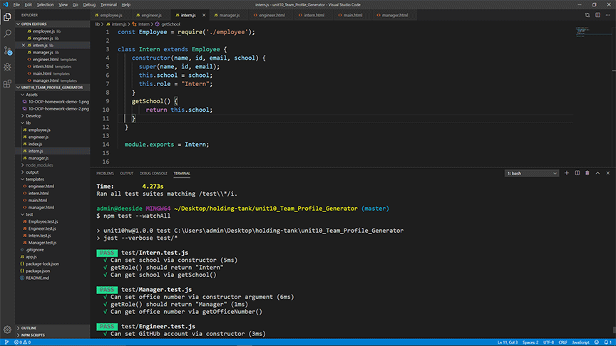

# Node JS Team Profile Generator

Here is a Node JS Team Profile Generator made in javascript, Node Js, HTML. When run in the command line, user is prompt about the team manager and informed about adding team members, such as an engineer and or an intern.  When information is returned, a HTML file is created with information of each individual team member.

## Making it click 

 1. After going through several assignments, the process in which each js file within the homework started to connect. First I had to make the test pass. That gave me a clue on what individual files had to be created and what I needed to make the class construtors pass. Oh, and going back to the readme file. 
 
 

### Animation of test and generated HTML

### Prerequisites

Any web browser can access or view link, repository. Use Command line or Terminal with Node JS installed to view index.js file.

## Built With
* [HTML](https://developer.mozilla.org/en-US/docs/Web/HTML)
* [CSS](https://developer.mozilla.org/en-US/docs/Web/CSS)
* [NodeJs] (https://nodejs.org/en/about/)
* [NPM] (https://www.npmjs.com/)

## Deployed Link
* No live site, see "repository"

## Authors
Dexter Valencia 

- [Link to Repository](https://github.com/itsmedexter/unit10_Team_Profile_Generator)
- [Link to Github](https://github.com/itsmedexter)
- [Link to LinkedIn](https://www.linkedin.com/in/dextervalencia/)

## License

This project is licensed under the MIT License 

## Acknowledgments

* Thanks to all for the help and I needed it.  
